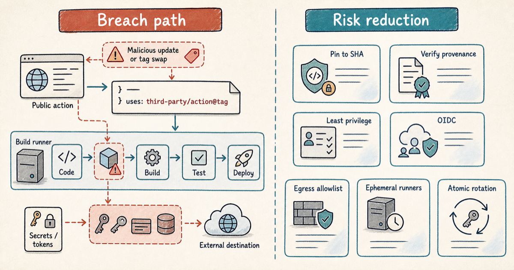

---
blog:
  publish: true
  slug: hardening-cicd-supply-chain-attacks
  title: "When Your Scanner Steals Your Keys: Hardening CI/CD After the Trivy Attack"
  description: A supply chain attack turned Trivy, a popular security scanner, into a credential stealer inside CI/CD pipelines. How to harden for all three stages, preventing the compromise, limiting the damage, and recovering fast.
  image: assets/hardening-cicd-supply-chain-attacks-hero.png
  date: 2026-07-10
  tags:
    - cybersecurity
    - devsecops
    - ci-cd
    - supply-chain
    - secrets-management
---

# When Your Scanner Steals Your Keys: Hardening CI/CD After the Trivy Attack



**TL;DR:** In 2026, attackers hijacked the GitHub Actions and releases of Trivy, a popular open-source security scanner, turning a tool teams ran to *find* vulnerabilities into one that stole their CI/CD secrets. You can never be certain a dependency will not turn on you, so harden for all three outcomes: prevent the compromise, limit the damage when prevention fails, and recover fast once damage is done.

I do security for a living, and supply chain attacks are the ones I find hardest to argue away. At some point you run someone else's code with your own credentials, on trust, and no amount of scanning removes that. So when I read an incident like this, I am not looking for someone to blame. I am asking which of my own habits would have saved me, and which would have failed the same way.

For most teams, the honest answer is recovery. Prevention gets the attention and most of the tooling, but very few shops have a written, rehearsed playbook for the moment a build system is actually compromised: what to rotate, in what order, and how to be sure the intruder is gone. That is the phase I want to spend the most time on here, and it is where this incident has the most to teach.

## What happened

It started quietly. In late February 2026, a group tracked as TeamPCP breached the release infrastructure behind Trivy, Aqua Security's widely used open-source vulnerability scanner. The way in was mundane: a misconfigured GitHub Actions workflow exposed a long-lived, over-privileged access token. The intrusion was disclosed on March 1, 2026, and Aqua began rotating credentials. But the rotation was staggered rather than atomic, and one still-valid token let the attackers grab the newly issued secrets before the old ones were revoked. Their foothold survived.

On March 19, 2026, they used it. In one coordinated strike they force-pushed 76 of 77 version tags in `aquasecurity/trivy-action` and all 7 tags in `aquasecurity/setup-trivy` to malicious commits, and published a poisoned Trivy v0.69.4 across GitHub, container registries, and package repos. The payload sat in `entrypoint.sh` and ran before the real scan. Every pipeline looked normal while a credential stealer quietly emptied it of GitHub tokens, cloud keys, SSH keys, and Kubernetes tokens. The loot was encrypted and shipped to a typosquatted domain. When that failed, the malware used victims' own stolen tokens to create public repositories in their accounts and upload the data as release assets.

More than 10,000 workflows referenced the action, and every one that ran during the exposure window had to treat its secrets as stolen. Those credentials then fed attacks further downstream, including a self-propagating npm worm, reaching organizations that had never run Trivy at all.

## So what do you actually do about it?

There was no zero-day here, and no clever exploit. A trusted tool was handed everything and asked no questions. You invited the thing in, so a taller wall will not save you. What saves you is preparing for all three stages of the event, in order:

1. **Prevent it.** Can we stop the malicious code from ever running?
2. **Limit the damage.** If it runs anyway, how little can it reach and steal?
3. **Recover faster.** Once we know we are hit, how quickly can we get back to clean?

Walk the Trivy incident through those three questions and every control below falls into place.

## 1. Prevent it: stop the malicious code from running

Most supply chain attacks die right here, if you simply refuse to run code you have not verified.

**Pin actions to a commit SHA, not a tag.** Tags are mutable, and this attack repointed 76 of them in a single repo. A SHA cannot be swapped underneath you.

```yaml
uses: aquasecurity/trivy-action@57a97c7   # v0.35.0, the one trivy-action tag the attack missed
```

**Pin container images by digest too.** The Docker images were poisoned as well, so `image@sha256:...`, never `:latest` or a version tag.

**Auto-update with a cooling period.** A SHA pin freezes you, so let Renovate or Dependabot bump it, but hold new releases for about a week first (`minimumReleaseAge`). The cooldown protects you from adopting a malicious *new* release; the SHA pin protects you from a *trusted tag* being repointed. Two attacks, two controls.

**Never run untrusted PR code with trusted permissions.** A `pull_request_target` workflow that checked out attacker-controlled code was flagged in Trivy's own repository months before the attack. That trigger runs with repository secrets and write access, so executing a PR branch under it lets an outside contributor run code as you. Use `pull_request` for outside contributions and keep secrets out of those runs.

## 2. Limit the damage: assume it ran anyway

Prevention fails eventually. When a malicious step runs, the whole game is to box it in: give it little to reach, nothing worth stealing, nowhere to take it, and no time to work. Four controls do that, and they interlock.

**Give every job least privilege.** Set `GITHUB_TOKEN` to read-only by default at the org level, grant write per job only where needed, and never pass `secrets: inherit` or `toJSON(secrets)` into reusable workflows. A compromised step should see only what that one job needs, never the whole vault.

**Hold no long-lived secrets, only short-lived tokens.** Use OIDC so the pipeline stores no keys at all. It trades the workflow's identity for temporary credentials that expire on their own, typically within an hour. There is no static key sitting in a secret store to lift, so the most valuable thing on the runner is a token that is already on a timer.

**Restrict the credential twice: when it is issued, and where it can be used.** This is where most setups stop too early, and it is the difference between a credential that is dangerous and one that is inert. Identity providers expose these as two separate controls.

- *At issue time, who can obtain it.* Bind the federated identity to a single repository and branch, so the credential can only be minted by that exact workflow. A fork, another branch, or another environment is refused, even if the attacker copies your workflow word for word.
- *At use time, where it works.* Attach a condition that ties the credential to your own network, so it is accepted only from your runners' known egress addresses. This is the half almost everyone skips, and it is the one that matters most. The issue-time check happens once, at minting; after that the credential is valid from anywhere for its full lifetime, including the attacker's own machine. The network condition is what turns a stolen, still-valid credential into a dead one, because a request coming from outside your environment is simply refused. It only works if your runners leave from a known, fixed set of addresses, which is exactly why you run your own disposable runners behind a controlled egress instead of shared, hosted ones.

**Shrink the window with ephemeral runners.** Just-in-time runners exist only for the length of the build, then the host is destroyed. If a workflow runs for five minutes, the credentials and the machine holding them live for five minutes. The attacker's entire opportunity collapses to that window, inside your environment. Provision each runner fresh for a single job and discard it afterward, so nothing carries over to the next run.

**Block the exit with egress control.** Default-deny outbound, and allowlist only the registries, mirrors, and cloud APIs a build actually needs. Even if the attacker grabs something during that five-minute window, there is nowhere to send it. The exfiltration call to a typosquatted domain would have been denied outright.

Put the four together and the attack folds in on itself. The attacker gets a few-minute window, inside your environment, holding a credential that will not work anywhere else and no path to ship anything out.

## 3. Recover faster: get back to a clean state

The Trivy re-compromise was a recovery failure, not a prevention one, and it is the part of this story I keep coming back to. Prevention is where teams spend their budget; recovery is where they improvise. If you cannot say what you would rotate first, and in what order, without calling a meeting, you do not have a recovery plan, you have a hope. Here is what a plan actually covers.

**Detect the tell-tales.** You cannot recover from what you cannot see. Alert on unexpected public repos in your org, outbound traffic to unknown domains from runners, and jobs touching secrets they should not.

**Rotate atomically, and know what you are rotating.** The entire re-compromise happened because rotation was staggered: a still-valid credential was used to scoop up the freshly issued ones mid-rotation. Two things prevent that. First, keep an inventory of every credential each pipeline can reach, so you know the full set before you start rather than discovering it halfway through. Second, revoke all of it in one pass, including live sessions and not just the underlying keys, then reissue. A half-finished rotation is an open door, and the bad day is the worst time to be working out the order.

**Rebuild, do not clean.** Because the runners are already ephemeral, a compromise leaves nothing persistent to hunt. Recovery is not forensics on a live host; it is redeploy from a known-good state and let the next clean run take over. Rehearse it once before you need it, the same way you would a backup restore, so the muscle memory is there when it counts.

## Bottom line

You will not stop every dependency from turning on you, so do not bet everything on prevention. Verify what you run, confine what runs anyway, and rehearse the recovery before you need it. Do all three and a headline-grade supply chain compromise becomes a contained non-event.
